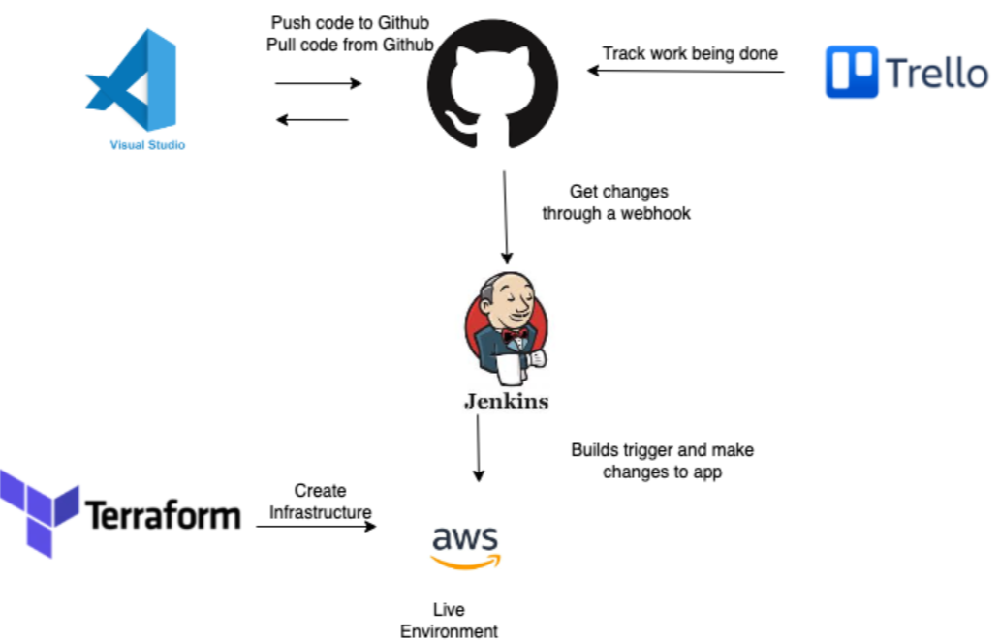
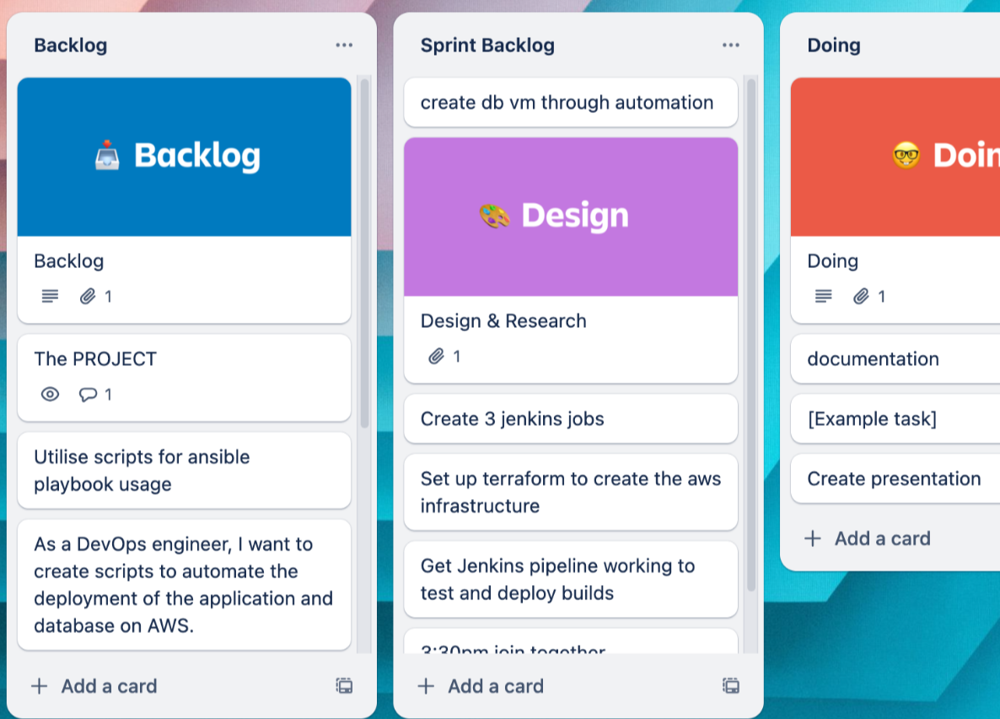

# Northwind Documentation

This is the documentation for a two tier deployment with CI/CD in Jenkins on AWS.

## Introduction
This document presents our strategy for deploying the Northwind Python application onto cloud-based infrastructure while adhering to DevOps principles. The application includes a homepage, a customer listing page, and a page for adding new customers. Our objective is to deploy the application efficiently, leveraging contemporary tools and methodologies acquired during our training. We aim to deliver a scalable, resilient, and automated deployment solution that aligns with modern software development practices. By utilising advanced DevOps tools, we seek to streamline the deployment process and enhance overall efficiency. Initially, we will manually validate functionality before progressing to the development of scripts and automation.

To achieve this a web, MySQL amd Jenkins VM needed to be set up and configured on AWS.

## Links to each documentation md file for the web/MySQL/Jenkins

- [Web Documentation](/Web%20Documentation.md)
- [Database Documentation](/Database%20Documentation.md)
- [Jenkins Documentation](/Jenkins%20Documentation.md)

## Architecture Overview

Our deployment strategy involves implementing a two-tier architecture, separating the application layer from the database layer. This architecture enhances scalability, maintainability, and security.

## Toolset

Our deployment process incorporates the following tools:

### Trello: To efficiently collaborate and complete tasks, we utilised Agile and Scrum methodologies and organised our tasks using Trello. 

Firstly we had to agree on a Scrum master so that we could set up a Scrum Board that contained user stories and action cards and then work in daily sprints. At the end of each day we had mini retrospectives so that we could move tasks from doing to done or assess where we were or any blockers.

Here is our [Trello board](https://trello.com/invite/b/QDreLhch/ATTI55983b89aaf73cdd3fd71ae4bed050ce7D9CD451/project) and an example of how our populated Trello board looked like:

### Jenkins: As our CI/CD automation server, Jenkins automates the build, test, and deployment phases of our application. Jenkins enables us to create robust pipelines that automatically trigger deployments upon code updates, ensuring rapid and reliable delivery of new features.

### AWS: Amazon Web Services (AWS) serves as the foundation for our cloud infrastructure, offering a diverse range of scalable and reliable services. We used AWS to deploy our servers for our application, database and jenkins.

## Terraform: As our IAC tool in order to automate the build of the AWS infrastructure, We decided to have this as an “if time” increment, for the database vm.

### If time:

#### Ansible: Utilised for automation, Ansible streamlines the provisioning and configuration of infrastructure components. Its simplicity and versatility make it an ideal choice for orchestrating our deployment process.

